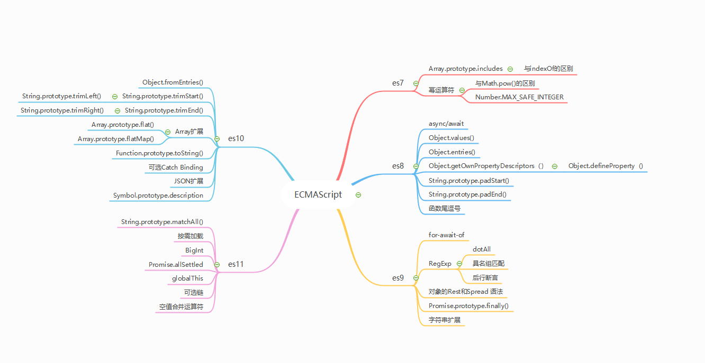

## ES 规范汇总

# ES11新特性

### 1. BigInt
es11为我们提供了第七种新的原始数据类型，对于js来说，他的最大取值范围是2的53次方
```
console.log(Number.MAX_SAFE_INTEGER);
// 9007199254740991
```
* 使用方式
```
 // 方式一
 console.log(9007199254740993);
 console.log(9007199254740993n);
 
 // 9007199254740992
 // 9007199254740993n
 
 // 方式二
 console.log(9007199254740993);
 console.log(BigInt(9007199254740993n));
 
 // 9007199254740992
 // 9007199254740993n
 1==1n // true
1 === 1n // false
typeof 1n // bigint
BigInt(9007199254740993n).toString() // 9007199254740993
```
### 2. 可选链
可选链可以使我们在查询具有多层级的对象时，不再需要进行冗余的各种前置校验
```obj
const a = {
  b: {
    c: {
      d: {
        e: "111",
      },
    },
  },
};
// es11前
const value = a && a.b && a.b.c && a.b.c.d && a.b.c.d.e;
console.log(value);
// es11:可选链
const value2 = a?.b?.c?.d?.e;
console.log(value2);
| 可选链中的 ? 表示如果问号左边表达式有值, 就会继续查询问号后面的字段 ， 可以大量简化类似繁琐的前置校验操作 。
```
### 3. 空值合并运算符
当我们查询某个属性时，经常会遇到，如果没有该属性就会设置一个默认的值
```
let a = 0
let b = a || 1
// b == 1
```
我们在使用 || 运算发时，变量0就是false，所以我们会看到上述会输出1，但是很多时候我们希望b的输出结构就是a的值0，es11提出了空值合并运算符（??）,当左侧操作符为null或undefined时，其返回右侧的操作数。否则返回左侧的操作数。
```js
let a = 0
let b = a ?? 1
// b == 0
```
### 4. Promise.allSettled
es6中Promise.all方法接受一个数组元素都是由Promise.resolve包装的数组，生成并返回一个新的Promise对象，如果参数中的任何一个promise为reject的话，整个Promise.all调用会立即终止，并返回一个reject的新的Promise对象。
```js
// 全部返回resolve
function getPromise(time) {
  return new Promise((resolve, reject) => {
    setTimeout(() => {
      resolve(time);
    }, time);
  });
}

Promise.all([getPromise(1000), getPromise(2000), getPromise(3000)]).then(
  (res) => {
    console.log(res);
  }
);
// [1000,2000,3000]

// 返回reject
function getPromise(time) {
  return new Promise((resolve, reject) => {
    setTimeout(() => {
      resolve(time);
    }, time);
  });
}
function getReject(time) {
  return new Promise((resolve, reject) => {
    setTimeout(() => {
      reject(time);
    }, time);
  });
}
Promise.all([getPromise(1000), getReject(2000), getPromise(3000)])
  .then((res) => {
    console.log(res);
  })
  .catch((err) => {
    console.log(err);
  });
// 2000
```
从上面可以看出Promise.all只要有一个任务返回reject,整个任务都会失败,我们需要一种机制，如果并发任务中，无论一个任务正常或者异常，都会返回对应的状态，这就是Promise.allSettled()的作用。
```js
function getPromise(time) {
  return new Promise((resolve, reject) => {
    setTimeout(() => {
      resolve(time);
    }, time);
  });
}

function getReject(time) {
  return new Promise((resolve, reject) => {
    setTimeout(() => {
      reject(time);
    }, time);
  });
}

Promise.allSettled([getPromise(1000), getReject(2000), getPromise(3000)])
  .then((res) => {
    console.log(res);
  })
  .catch((err) => {
    console.log(err);
  });
  
// [{status: "fulfilled", value: 1000},
//  {status: "rejected", reason: 2000},
//  {status: // "fulfilled", value: 3000}]

```
### 5. import
* 按需加载
```js
现代前端打包资源越来越大，打包成几M的JS资源已成常态，而往往前端应用初始化时根本不需要全量加载逻辑资源，为了首屏渲染速度更快，很多时候都是按需加载，比如懒加载图片等。
```
```js
(async () => {
  if (somethingIsTrue) {
    // import module for side effects
    await import('xxx/xxx.js');
  }
})();
```
### 6. String.prototype.matchAll()
1. matchAll()方法返回一个包含所有匹配正则表达式及分组捕获结果的迭代器;
2. 使用： str.matchAll(regexp);
字符串处理的一个常见场景是想要匹配出字符串中的所有目标子串，例如：
* match()
```js
const str =
"es2015/es6 es2016/es7 es2017/es8 es2018/es9 es2019/es10 es2020/es10";
console.log(str.match(/(es\d+)\/es(\d+)/g));
// ["es2015/es6", "es2016/es7", "es2017/es8", "es2018/es9", "es2019/es10", //"es2020/es10"]
```
match()方法中，正则表达式所匹配到的多个结果会被打包成数组返回，但无法得知每个匹配除结果之外的相关信息，比如捕获到的子串，匹配到的index位置等。
* exec()
```js
const str =
"es2015/es6 es2016/es7 es2017/es8 es2018/es9 es2019/es10 es2020/es10";
const reg = /(es\d+)\/es(\d+)/g;
let matched;
let formatted = [];
while ((matched = reg.exec(str))) {
formatted.push(`${matched[1]}-es${matched[2]}`);
}
console.log(formatted);

//["es2015-es6","es2016-es7","es2017-es8","es2018-es9","es2019-es10",
//"es2020-es10"]
```
* matchAll()
```js
const str =
  "es2015/es6 es2016/es7 es2017/es8 es2018/es9 es2019/es10 es2020/es10";
const reg = /(es\d+)\/es(\d+)/g;

const matchs = [];
for (let match of str.matchAll(reg)) {
  matchs.push(`${match[1]}-es${match[2]}`);
}
console.log(matchs);
//  ["es2015-es6", "es2016-es7", "es2017-es8", "es2018-es9", "es2019-es10", "es2020-es10"]

```
```|matchAll() 是返回一个迭代器，对大数据量的场景更友好 。```
### 7. globalThis
javaScript在不同的环境获取全局对象的不同方式：
* node中通过global
* web中通过window, self。
es11 提出了globalThis一句话总结就是：无论是在Node环境还是web中，全局作用域中的this可以通过globalThis访问，不必担心他的运行环境。
### 8. for...in 遍历机制
```js
JavaScript 中通过for-in遍历对象时 key 的顺序是不确定的，因为规范没有明确定义，并且能够遍历原型属性让for-in的实现机制变得相当复杂，不同 JavaScript 引擎有各自根深蒂固的不同实现，很难统一
所以 es11不要求统一属性遍历顺序，而是对遍历过程中的一些特殊 Case 明确定义了一些规则：
遍历不到 Symbol 类型的属性
遍历过程中，目标对象的属性能被删除，忽略掉尚未遍历到却已经被删掉的属性
遍历过程中，如果有新增属性，不保证新的属性能被当次遍历处理到
属性名不会重复出现（一个属性名最多出现一次）
目标对象整条原型链上的属性都能遍历到 所以要用for...of
```
# ES10
### 1. Object.fromEntries()
es8中对象添加了一个entries()静态方法，这个方法返回一个给定对象自身可枚举属性的键值对数组，Object.fromEntries()方法与Object.entries()正好相对，可以将键值对列表转换为一个对象。
```js
const obj = {
  x: 1,
  y: 2,
};
const entries = Object.entries(obj);
console.log(entries);
console.log(Object.fromEntries(entries));
// [["x",1],["y":2]]
// {x:1,y:2}
```
`| 只要符合entries结构的都可以使用Object.fromEntries(entries)将键值对列表转换为一个对象，比如MAP`
### 2. String.prototype.trimStart/ String.prototype.trimEnd
* trimStart/trimLeft    
  `| trimLeft是trimStart的别名，作用是取得字符串左边的空格`
* trimEnd/trimRight     
  `trimEnd是trimRight的别名，作用是去掉字符串右边的空格`
```js
const str = "   hello world   ";
console.log(str.trimStart());
console.log(str.trimEnd());
console.log(str.trim());

// "hello world   "
// "   hello world"
// "hello world"
```
### 3. Array.prototype.flat/Array.prototype.flatMap
* Array.prototype.flat  
flat方法会按照一个可制订的深度递归遍历数组，并将所有元素与遍历到的子数组中的元素合并为一个新的数组返回。
```js
const arr = [1, [2, [3, [4, [5, [6, 7], 8], 9]]]];
console.log(arr.flat(1));
console.log(arr.flat(5));
console.log(arr.flat(Infinity));
// [1,2,[3, [4, [5, [6, 7], 8], 9]]]
// [1,2,3,4,5,6,7,8,9]
// [1,2,3,4,5,6,7,8,9]
```
* 自定义实现方法
```js
function flat(arr, deep = 1) {
  const newArray = [];
  let deepNum = 0;
  const flatMap = (arr) => {
    arr.map((item, index, array) => {
      if (Array.isArray(item)) {
        if (deepNum < deep) {
          deepNum++;
          flatMap(item);
        } else {
          newArray.push(item);
        }
      } else {
        newArray.push(item);
        if (index === array.length - 1) deepNum = 0;
      }
    });
  };
  flatMap(arr);
  return newArray;
}
const arr = [1, [2, [3, [4, [5, 6], 7], 8]]];
console.log(flat(arr, 4));
```
*   Array.prototype.flatMap     
flatMap实质上包含两部分功能,一是Map,二是flat
```js
const numbers = [1, 2, 3];
console.log(numbers.map((x) => [x ** 2]).flat());
console.log(numbers.flatMap((x) => [x ** 2]));
// [1,4,9]
// [1,4,9]
```    
### 4. Symbol.description
* 可以通过description获取Symbol的描述
```js
const symbol = Symbol("symbol");
console.log(symbol.description); // symbol
console.log(symbol.description === "symbol"); // true

console.log(symbol.toString() === "Symbol(symbol)");
// 在es10之前，我们只能通过调用Symbol的toString来读取这个数据
```
### 5. Function.prototype.toString
* Function.prototype.toString方法返回一个表示当前函数源代码的字符串
```js
function test(a) {
  // es10以前不返回注释部分
  console.log(a);
}
console.log(test.toString());
// function test(a) {
//  // es10以前不返回注释部分
//  console.log(a);
// }
```
### 6. catch Building
* es10允许我们在捕获异常时省略catch的参数
```js
// es10以前
try {
  throw new Error();
} catch (error) {
  console.log("fail");
}
// es10
try {
  throw new Error();
} catch {
  console.log("fail");
}
```
### 7.JSON扩展
* JSON内容可以支持包含U+2028行分隔符与U+2029段分隔符
* 在ES10JSON.stringify会用转义字符的方式来处理超出范围的Unicode展示错误的问题而非编码的方式
```js
console.log(JSON.stringify('\uD83D\uDE0E')) // 笑脸
// 单独的\uD83D其实是个无效的字符串
// 之前的版本 ，这些字符将替换为特殊字符，而现在将未配对的代理代码点表示为JSON转义序列
console.log(JSON.stringify('\uD83D')) // "\ud83d"
```
# ES9
### 1. for await of/Symbol.asyncIterator
```js
es6中有一个新特性Iteartor,只要元素符合两个协议：
可迭代协议：对象包含Symbol.iterator属性；
迭代器协议：Symbol.iterator属性必须返回一个对象，这个对象包含一个next方法，且next方法也返回一个对象，此对象包含value,done两个属性
我们就可以使用for...of去遍历这个元素。
```
* 我们知道for...of可以遍历同步运行的任务，那如果是异步的呢，如下：
```js
function getPromise(time) {
  return new Promise((resolve, reject) => {
    setTimeout(() => {
      resolve(time)
    }, time)
  })
}
const asyncArr = [getPromise(1000), getPromise(200), getPromise(3000)]
for (let item of asyncArr) {
  console.log(item, item.then(res => {
    console.log(res)
  }))
}
// Promise {<pending>} 
// Promise {<pending>}
// Promise {<pending>}
// 200
// 1000
// 3000
```
在上述遍历的过程中可以看到三个任务是同步启动的，我们期望的是一个异步任务执行完，再执行下一个异步任务，然而从输出可以看出不是按任务的执行顺序输出的，这显然不符合我们的要求，在ES9中也可以用for...await...of来操作：
```js
function getPromise(time) {
  return new Promise((resolve, reject) => {
    setTimeout(() => {
      resolve({
        value: time,
        done: false,
      });
    }, time);
  });
}

const asyncArr = [getPromise(1000), getPromise(200), getPromise(3000)];
asyncArr[Symbol.asyncIterator] = function () {
  let nextIndex = 0;
  return {
    next() {
      return nextIndex < asyncArr.length
        ? asyncArr[nextIndex++]
        : Promise.resolve({
            value: undefined,
            done: true,
          });
  },
  };
};

async function test() {
  for await (let item of asyncArr) {
    console.log(Date.now(), item);
  }
}

test();

// 1594374685156 1000
// 1594374685157 200
// 1594374687157 3000

```
`await需要在async 函数或者 async 生成器里面使用`
* 同步迭代器/异步迭代器
  
  | 类别	 | 同步迭代器 | 异步迭代器 |
  | :-----| ----: | :----: |
  | 迭代器协议| Symbol.iterator | Symbol.asyncIteartor |
  | 遍历 | for...of | for...await...of |
### 2. 正则的扩展
* dotAll/s  
一句话总结dotAll模式就是：在正则中使用（.）字符串使用s修饰符可以解决(.)字符不能匹配行终止符的例外
```js
console.log(/./.test(1));
console.log(/./.test("1"));
console.log(/./.test("\n"));
console.log(/./.test("\r"));
console.log(/./.test("\u{2028}"));
// true
// true
// false
// false
// false
// 使用s修饰符
console.log(/./s.test(1));
console.log(/./s.test("1"));
console.log(/./s.test("\n"));
console.log(/./s.test("\r"));
console.log(/./s.test("\u{2028}"));
// true
// true
// true
// true
// true
```
```js
1. （.）是一个特殊字符，代表任意的单个字符，但是有两个例外。一个是四个字节的 UTF-16 字符，这个可以用u修饰符解决；另一个是行终止符
2. 正则中可以使用的修饰符有i,g,m,y,u,s
```
* 具名组匹配EP:
  ```
  console.log("2020-07-10".match(/(\d{4})-(\d{2})-(\d{2})/));
  // ["2020-07-10", "2020", "07", "10", index: 0, input: "2020-07-10", groups: undefined]
  ```
按照 match 的语法，没有使用 g 修饰符，所以返回值第一个数值是正则表达式的完整匹配，接下来的第二个值到第四个值是分组匹配（2020, 07, 10）,我们想要获取年月日的时候不得不通过数组的下标去获取，这样显得不灵活。仔细观察 match 返回值还有几个属性，分别是 index、input、groups。
```js
1. index[匹配的结果的开始位置]
2. input[匹配的字符串]
3. groups[捕获组]
```
所谓的具名组匹配就是命名捕获 分组:
```
console.log("2020-07-10".match(/(?<year>\d{4})-(?<month>\d{2})-(?<day>\d{2})/));
// groups的值
groups: {year: "2020", month: "07", day: "10"}
```
这样我们通过groups及命名分组捕获对应的年月日的值了。
* 后行断言
```js
let test = 'world hello'
console.log(test.match(/(?<=world\s)hello/))
// [0: "hello" ,groups: undefined, index: 6 ,input: "world hello"]
```
`(?<)是后行断言的符号配合=、!等使用`
### 3. 对象的Rest和Spread语法
* 一个例子对比理解对象的Rest和Spread语法
  ```js
  const arr1 = [1,2,3]
  const arr2 = [4,5,6]
  // 数组合并
  const arr = [...arr1,...arr2]
  console.log(arr)
  const obj1 = {a:1}
  const obj2 = {b:2}
  // 对象合并
  const obj = {...obj1,...obj2}
  console.log(obj)
  // [1,2,3,4,5,6]
  // {a:1,b:2}
  ```
  一句话总结就是(...)原酸副在数组中可以怎样使用，在对象就可以怎样使用。
### 4. Promise.prototype.finally
* 不管promise状态如何都会执行的回调函数
```js
new Promise((resolve, reject) => {
  resolve(1);
})
  .then((res) => {
    console.log(res);
  })
  .catch((err) => {
    console.log(err);
  })
  .finally(() => {
    console.log("finally");
  });
// 1
// finally
```
### 5. 带标签的模板字符串扩展
es9新特性中医除了对ECMAScript带标签的模板字符串中转移序列的语法限制。遇到不合法的字符串转义返回undefined,并且从raw上可获取原字符串
```js
function foo(str) {
  console.log(str)
}
foo`\undfdfdf`
// es9以前报错
// es9:[undefined,raw:["\undfdfdf"]]
```
# ES8
### 1. async/await
```js
1. async/await是继es6中promise、generator后又一种更加优雅的异步编程的解决方案
2. async函数是generator函数的语法糖
```
* 基本用法
```
// 不使用async/await
function getPromise() {
  return new Promise((resolve,reject) => {
    setTimeout(() => {
      console.log(1)
      resolve(2)
    }, 1000)
  })
}
function foo() {
  let res = getPromise()
  console.log(res)
  console.log(3)
}
foo()
// Promise {<pending>}
// 3
// 1
// 使用async/await
async function foo(){
  let res = await getPromise()
  console.log(res)
  console.log(3)
}
foo();
// 1
// 2
// 3
```
由上面两个例子的对比就能发现，async/await 可以使异步任务处理起来像是同步任务，这是因为await关键字在执行的时候会停下来，等待异步任务执行完毕(await后面一般跟的是异步任务，否则没有意义)在继续执行同步任务。
* 更优雅的异步编程的解决方案
- 在es6之前我们对于这个过程应该不陌生
  ```
  ajax('xxx/a', res => {
    console.log(res)
    ajax('xxx/b', res => {
        console.log(res)
        ajax('xxx/c', res => {
            console.log(res)
        })
    })
  })
  ```
- 这种回调之后再回调的调用方式我们称之为“回调地狱”，这种回调方式在日常开发和项目维护当中很让人头疼。我们对比下es6中Promise的处理和es8中的async/await的处理方式就知道了为什么我们称async/await为更优雅的异步编程的解决方案。
  ```js
  // 以下都是模拟接口请求的代码
  // Promise
  function getPromise(url) {
    return new Promise((resolve, reject) => {
      ajax(url, res => {
        resolve(res)
      }, err => {
        reject(err)
      })
    })
  }
  getPromise('xxx/a')
    .then(res => {
      console.log(res)
      return getPromise('xxx/b')
    }).then(res => {
      console.log(res)
      return getPromise('xxx/c')
    }).then(res => {
      console.log(res)
    }).catch(err => {
      console.log(err)
  })
  // async/await
  function request(url) {
    return new Promise(resolve => {
      ajax(url, res => {
        resolve(res)
      })
    })
  }
  async function getData() {
    let res1 = await request('xxx/a')
    console.log(res1)
    let res2 = await request('xxx/b')
    console.log(res2)
    let res3 = await request('xxx/c')
    console.log(res3)
  }
  getData()
  ```
从两者的对比可以看出，Promise虽然将回调嵌套回调的方式改成平级调用，但是这种调用方式相比于async/await还是显得繁琐，而且async/await不存在回调
### 2. Object.values/Object.entries
* 我们如何获取一个对象的每一个属性值？在es5中我们常用Object.keys()及for in来直接获取
```js
// Object.keys()
const obj = {
  name: "张三",
  age: 18,
  sex: "male",
}
const values = Object.keys(obj).map(item => {return obj[item]})
console.log(values) // ["张三"，18,"male"]
// for in
for (let key in obj) {
  console.log(obj[key])
}
// "张三",18,"mal"
```
es8为我们扩展了两个新的静态方法
* Object.values
`Object.values()返回一个数组，其元素是在对象上找到的可枚举的属性值`
```js
const obj = {
  name: '张三',age: 15
}
log(Object.values(obj)) // ['张三',15]
```
* Object.entries
`Object.entries()方法返回一个给定对象自身可枚举属性的键值对数组。`
```js
const obj = {
  name: "张三",
  age: 18,
  sex: "male",
}
console.log(Object.entries(obj))
// [["name", "张三"],["age", "18"], ["sex", "male"]]
```
* for in 与Object.keys/Object.values/Object.entries去别
> 从前面的例子可以看出for in 与 Object.keys/Object.values/Object.entries均可遍历对象的可枚举属性，那么他们之间有什么区别呢。
```js
const obj = {
  name: "张三",
  age: 18,
  sex: "male",
}
Object.prototype.test = "test"
for (let key in obj) {
  console.log(obj[key])
}
// 张三, 18, male, test
console.log(Object.keys(obj).map(key => obj[key]))
// ["张三", 18, "male"]
console.log(Object.values(obj))
// ["张三", 18, "male"]
console.log(Object.entries(obj).map(([key, value]) => value))
// ["张三", 18, "male"]
```
for in 可以遍历出原型链上的可枚举属性，而Object.keys/Object.values/Object.entries之恩能够遍历自身的可枚举属性
如何实现一个Object.values/Object.entries
```js
const obj = {
  name: "张三",
  age: 18,
  sex: "male",
}
// Object.values
function values(obj) {
  return Object.keys(obj).map(key => obj[key])
}
// Object.entries
function entries(obj) {
  return Object.keys(obj).map(key => [key, obj[key]])
}
console.log(values(obj)) 
console.log(entries(obj))
```
### 3. Object.getOwnPropertyDescriptors
* 前面提到的可枚举属性，我们怎么设置属性的值可枚举呢？
> Object.defineProperty可以通过对描述符的设置进行更精准的控制对象属性，所谓描述符
> - value       [属性的值]
> - writable    [属性的值是否可被改变]
> - v [属性的值是否可被枚举]
> - value [描述符本身是否可被修改，属性是否可被删除]
```js
var test = {
  name: '测试',
  value: 4
}
Object.defineProperty(test, 'name', {
  enumerable: false
})
for (let key in test) {
  console.log(key)
}
//value
```
* Object.getOwnPropertyDescriptors
> Object.getOwnPropertyDescriptors()可以返回对象属性的描述符
```js
let test = {name: '测试', value: 5}
console.log(Object.getOwnPropertyDescriptors(test))
// {
//   name: {value: "测试", writable: true, enumerable: true, configurable: true}
//   value: {value: 5, writable: true, enumerable: true, configurable: true}
// }
```
> Object.getOwnPropertyDescriptors(target,param)接收两个参数，返回某一个参数的描述符，通过这个方法可以实现一个Object.getOwnPropertyDescriptors()
* Object.getOwnPropertyDescriptors实现
```js
let test = {
  name: '测试',
  value: 5
}

function getOwnPropertyDescriptors(obj) {
  const result = {};
  for (let key of Reflect.ownKeys(obj)) {
    result[key] = Object.getOwnPropertyDescriptor(obj, key);
  }
  return result;
}
getOwnPropertyDescriptors(test)

```
### 4. String.prototype.padStart/String.prototype.padEnd
* padStart
> es8中String新增了两个实例函数String.prototype.padStart和String.prototype.padEnd，允许将空字符串或其他字符串添加到原始字符串的开头或结尾
先看一个例子，希望把日当前日期格式化：yyyy-mm-dd的格式
```js
// 返回一个yyyy-mm-dd格式的日期
function getTime() {
  const date = new Date();
  const year = date.getFullYear()
  const month = date.getMonth() + 1
  const day = date.getDate()
  return `${year}-${month}-${day}`
}
console.log(getTime())
// 2020-7-9

function getTime() {
  const date = new Date();
  const year = date.getFullYear()
  const month = (date.getMonth() + 1).toString().padStart(2, "0")
  const day = (date.getDate()).toString().padStart(2, "0")
  return `${year}-${month}-${day}`
}
console.log(getTime())
// 2020-07-09
```
* padEnd
> 在正式项目中后台返回的数据中时间一般会转为时间戳格式，处理时间戳的时候单位都是ms毫秒(13位),但有时候可能是S(10位)秒做单位，这个时候我们需要一个13位的不全，保证单位是毫秒。

`time = String(time).padEnd(13,'0')`
### 5.尾逗号
> 此前，函数定义和调用时，都不允许最后一个参数后面出现逗号，es8允许函数的最后一个参数有尾逗号

```js
// es8以前
function foo(a, b, c, d) {
  console.log(a, b, c, d)
}

// es8
function foo(a, b, c, d,) {
  console.log(a, b, c, d)
}
```
# ES 7
### 1. Array.prototype.includes
* 我们如何判断一个数组是否包含一个元素？
- es5 用indexOf
  ```js
  const arr = ["es6", "es7", "es8", "es9", "es10", "es11"]
  console.log(arr.indexOf("es6"))   // 0
  console.log(arr.indexOf("es12"))  // -1
  // 2
  const item = arr.find((item) => {
    return item === "es6"
  })
  console.log(item)   // "es6"
  ```
那么这两种方式有什么弊端呢，我们往下看：
```js
const arr = ["es6", "es7", "es8", "es9", "es10", "es11", NaN]
console.log(arr.indexOf(NaN))  // -1
const item = arr.find((item) => {
  return item === NaN
})
console.log(item)             // undefined
```
由此我们可以看出，es5的传统方法不满足我们的需求，无法判断数组中是否含有NaN，由此，es7提供给数组一个新的API，就是Array.prototype.includes
* 基本用法
```js
const arr = ["es6", "es7", "es8", "es9", "es10", "es11"，NaN]
console.log(arr.includes("es6"))   // true
console.log(arr.includes(NaN))   // true
console.log(arr.includes("es12"))  // false
```
> - Array.prototype.includes（）：可以接收两个参数，要搜索的值和搜索的开始索引。第二个参数可选，若为负数表示从末尾开始计数下标。
> - 只能判断简单类型的数据，对于复杂类型的数据，比如对象类型的数组，二维数组，这些是无法判断的。
* includes的用法和indexOf用法相似，都可以用来判断数组中是否包含一个元素，唯一的区别在于includes可以识别NaN
### 2. 幂运算符

* 我们如何求一个数的幂运算呢?  
```js
es5 中我们有两种方式来实现
// 通过Math.pow()
console.log(Math.pow(2,53))

// 自定义pow函数
function pow(base, exponent) {
  let sum = 1;
  for (let i = 0; i <exponent; i += 1) {
    sum *= base
  }
  return sum
}
console.log(pow(2, 53));

es7提供了一种**运算符，可以更简单实现
console.log(2**53)
```
> 幂运算符的两个* 之间不能出现空格，前后有无空格都可以
> 注意最大安全数：Number.MAX_SAFE_INTEGER = (2**53)-1


独立做事也有几个层次：

* 独立Coding：给你一个目标自己做完，不让别人给你擦屁股就可以了。
* 独立带人：要注重提问的水平，帮助他演进他的想法。
* 独立带团队：进入到这个阶段，要关注的更多，整个团队的氛围、工作效率，运用你一技之长的工程经验带领团队高效优质的产出成果，实现1+1>2。
* 独立做业务：团队稳定之后，开始关注所做的业务，行业的发展，理解你的用户，他们是谁，他们在哪，他们为什么使用你的产品，为团队指引下一步的产研方向。
* 独立生存：独立做事的最高水平，就是能带领一群人养活自己，独立生存下来。互联网的商业模型只有有限的那么几种，深谙其中的玩法，寻找擅长的合适的模型养活一群小伙伴，意味着一次更大的蜕变。

```
主题：主会场 - 一个程序员的成长之路
时间：2018年5月19日 10:40
地点：中国 上海
演讲嘉宾：张云龙-全民直播-CTO
```
