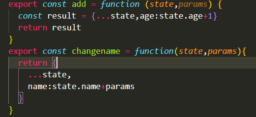

# Ckstore


## **https://github.com/chen406226/File/blob/master/ckstore/README.md**
## 概括
一个轻量化的基于react的状态管理工具，可以用于替代redux，优点轻量，没有第三者（订阅模式）。效率高

## 使用说明
### Installation
```
npm install --save ckstore
```
### Use
```
import {create,connect} from 'ckstore'
```

####create(property,actions,Comp)
此函数为创建store函数接收三个参数

-property（接收初始化store值）

-actions (接收操作store函数)

-Comp (组件)
#### connect(Comp)
共享的子组件

###Code
#### createaction.js
你只需要归类一个actions文件即可


里面



#### Todo.js


TodoChild组件通过connect之后，可以通过props获得store的属性与操作，我们已经把action里面的方法注册到Props里面了


